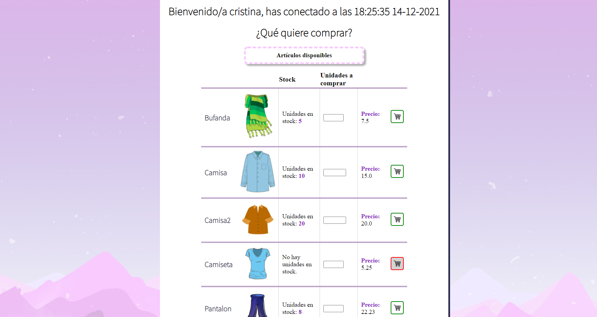
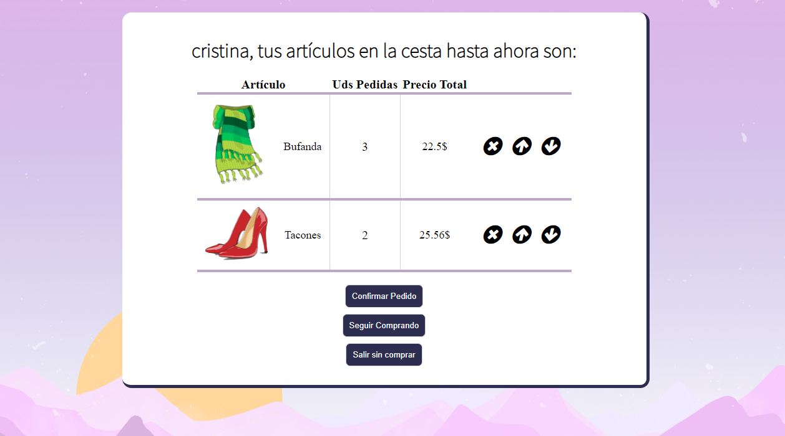
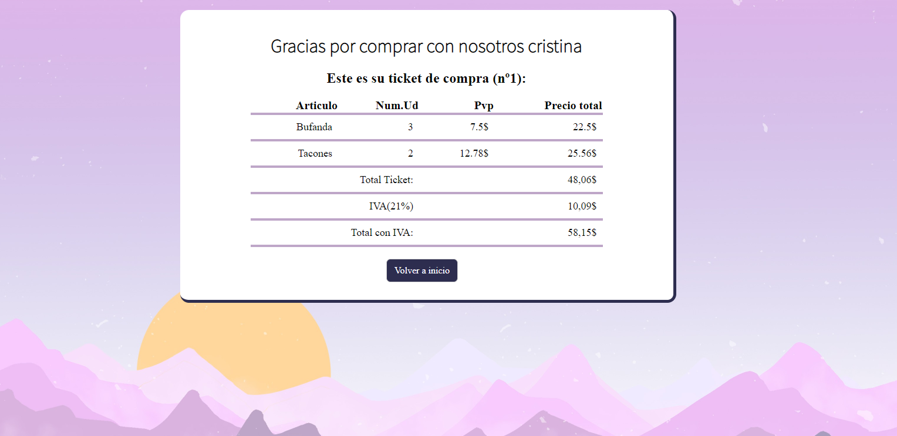

# ShoppingPage
 ·Java Servlets, CSS3, HTML5.      
 ·Display a list of products (read from a XML file).   
 ·You can buy articles, see your shopping cart and display your ticket.      
 ·Stocks are updated after buying.  
 
 # TO RUN THIS APP IN YOUR PC: 
-->Install Tomcat
-->Copy this file to Tomcat webapps directory
-->Turn on Tomcat
-->Access to localhost:yourport/ShoppingPage
-->Enjoy the web app!

# SEE HOW IT LOOKS:

<h2>SHOP</h2>

<h2>SHOPPING BASKET:</h2>

<h2>TICKET</h2>

